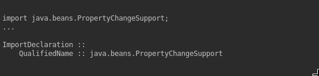
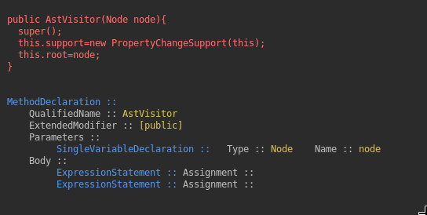
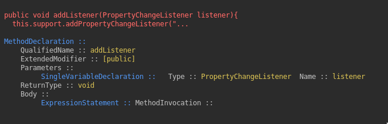

# Yet another java ASTParser

This ASTParser is based on [A complete standalone example of ASTParser](https://www.programcreek.com/2011/01/a-complete-standalone-example-of-astparser/) by `programcreek`.


## Requirements

Make sure you have Apache Maven installed. 

You can check that with ```mvn -v``` command.

If you don't have Maven, follow the install instruction at the [Maven webpage](https://maven.apache.org/install.html).
 
If you use Mac OS, you can install it with the [homebrew](https://brew.sh/) formula: 

```brew install maven```


## Execution

Place the resources you want to analyze under ```/src/resources/input/``` and change the parsed file at the [Main](/src/main/java/cs/ubc/ca/Main.java) class

You can also run  this project using JUnit and writing a test case under [JavaASTTest](/src/test/java/cs/ubc/ca/ast/JavaASTTest.java)


## Properties

```colored```: If your IDE or terminal supports [ANSI escape codes](https://en.wikipedia.org/wiki/ANSI_escape_code) your output will be colored:
 


vs




```fullLog```: Before printing the AST elements of a node, the log prints the node code itself. This property defines whether the full node will be printed or only the first 100 characters. 

The colored output presents an example with the property set to ```true``` while the example below shows it set to ```false``` 





## Implementation details

Under the ```visitor``` package, all classes that print the AST data about a node  extend ```ASTVisitor``` from the [Eclipse JDT API](https://help.eclipse.org/neon/index.jsp?topic=%2Forg.eclipse.jdt.doc.isv%2Freference%2Fapi%2Forg%2Feclipse%2Fjdt%2Fcore%2Fdom%2FASTVisitor.html).

To visit a node, you have to override the appropriate visit method. See an example below:

```java
public boolean visit(PackageDeclaration node) {
    this.nodeInfo(node);

    Ansi header = ansi().fg(BLUE).a("\nPackageDeclaration ::").reset();
    this.print(header);

    String qualifiedName = node.getName().getFullyQualifiedName();

    Ansi body = ansi().a("\tQualifiedName :: ").fg(YELLOW).a(qualifiedName).reset();
    this.print(body);
    this.endVisit();
    return false;
}

```

1. First, we log the visited node with ```this.nodeInfo(node);```

1. Then, we create a header and print it. 
It's advisable that the header matches the visit parameter type. 
In this case, ```PackageDeclaration```

1. We use the node methods and attributes to extract the information we want tho present in our parser, e.g. ```String qualifiedName = ... ``` 

1. Finally, we log that as part of our body method ```Ansi body = ... ``` followed by ```this.print(body);``` 

    1. The body is created with the ```ansi()``` method 
     
    1. Logged information is added with the ```.a(<string>)``` method.
    
    1. Anything after a ```fg(COLOUR)``` will be printed in the respective ANSI colour
    
    1. ```reset()``` clears colour codes and change the text back to its default colour 
     
 
